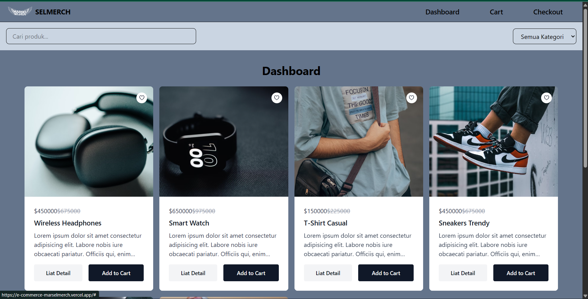

# 🛍️ Selmerch - E-Commerce Merchandise Marsel Wijaya

Selmerch adalah website e-commerce sederhana yang dibuat untuk menjual merchandise resmi dari **Marsel Wijaya**.  
Website ini dibangun dengan **React** dan **Tailwind CSS**, serta di-deploy menggunakan **Vercel**.

🔗 Live Demo: [Selmerch](https://e-commerce-marselmerch.vercel.app/)

---

## ✨ Fitur

- 🔎 Pencarian produk berdasarkan nama
- 📂 Filter produk berdasarkan kategori
- 🛒 Tambah produk ke keranjang (Add to Cart)
- 📖 Halaman detail produk
- 💳 Proses checkout sederhana
- 🎨 Desain modern dengan Tailwind CSS

---

## 🚀 Teknologi

- [React](https://react.dev/) - Frontend library
- [Tailwind CSS](https://tailwindcss.com/) - Styling
- [Vercel](https://vercel.com/) - Deployment

---

## 📦 Instalasi

1. Clone repository ini
   ```bash
   git clone https://github.com/username/selmerch.git

2. Masuk ke folder project
    ```bash
    cd selmerch

3. Instal depedensi
    ```bash
    npm install

4. Jalankan Project Di local
    ```bash
    npm run dev

5. Buka di localhost
    ```bash
    http://localhost:3xxx

6. Priview Dashboard react
